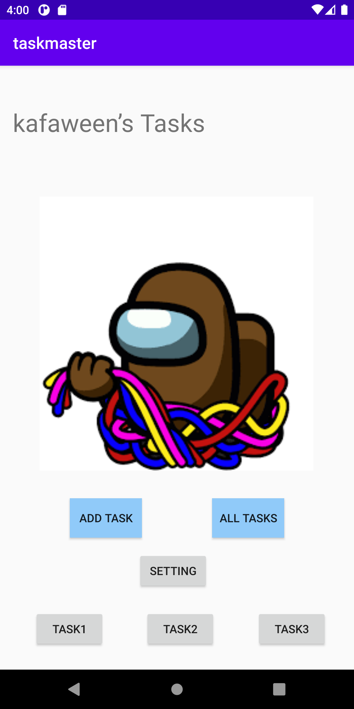
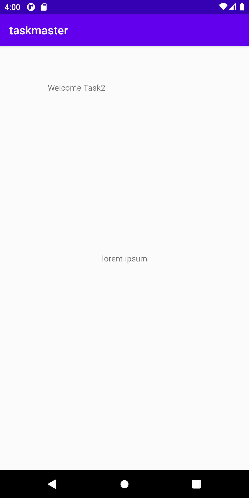
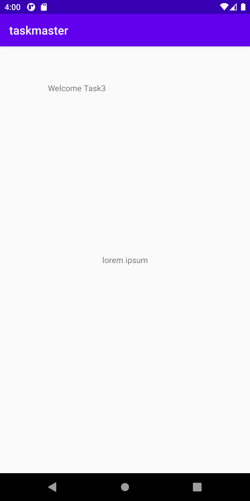
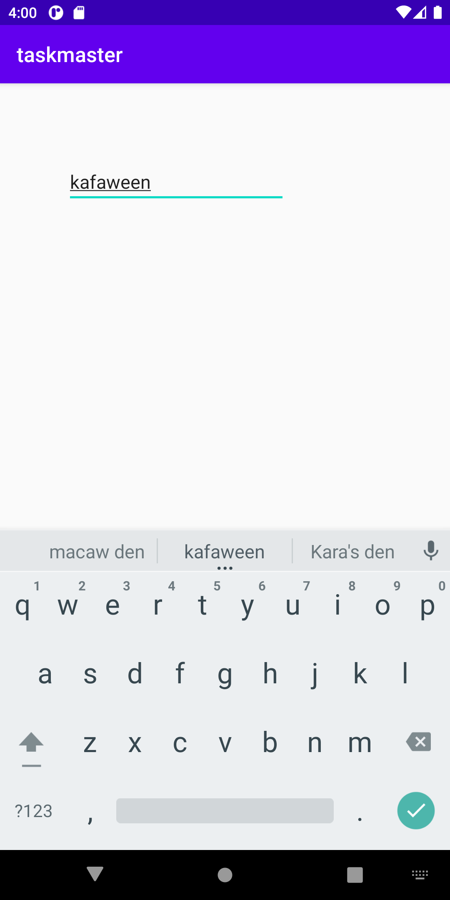

# taskmaster

Lab num|Date|Lab description
---|---|---
26|1/10|What i am doing today is the following: we created 3 bottuns on the main and when you click on one of them it takes you  task page with the name of the buttone you clicked and when you inter user name in the setting page in will show on the main page

Image:

