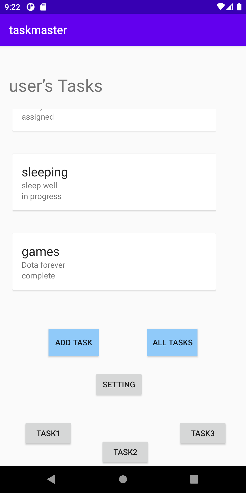
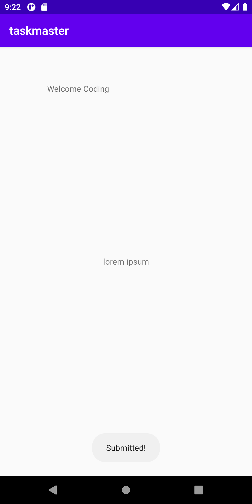

# taskmaster

Lab num|Date|Lab description
---|---|---
26|2/10|What i am doing today is the following: i created model to hold my recylcerview with title and body and state ,then i created recycler view in the main,and the a created another layout to howld my liear layout for title and bod and state and used adapter to reach that layout and handl theem inside it ,lastly i created static objects of tybe task and rednered them in the main recycle view

Image:

w
