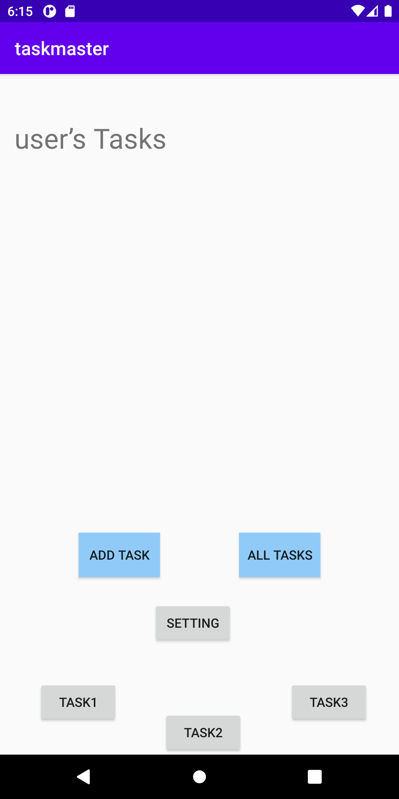
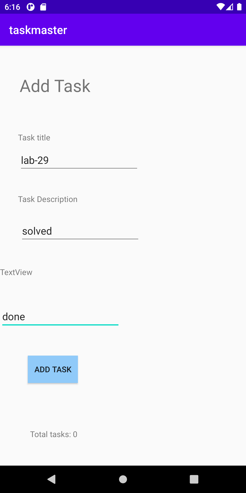
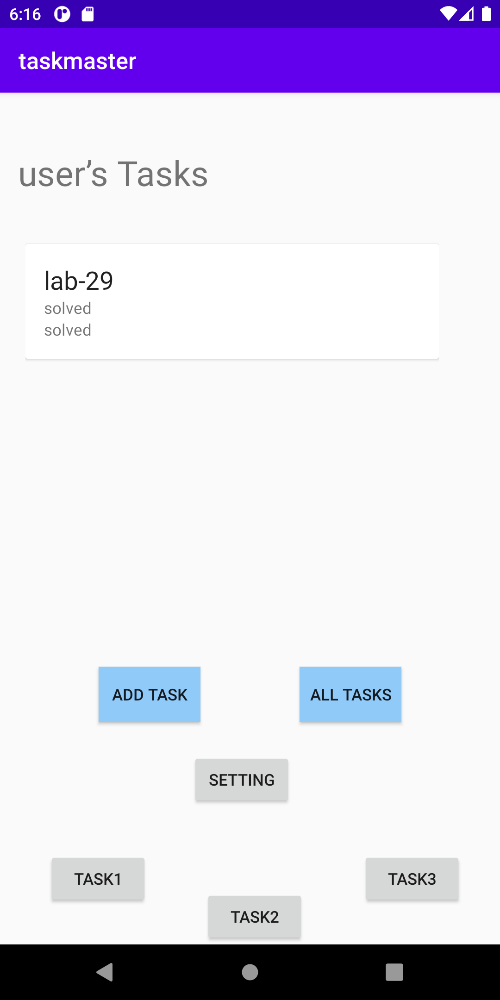
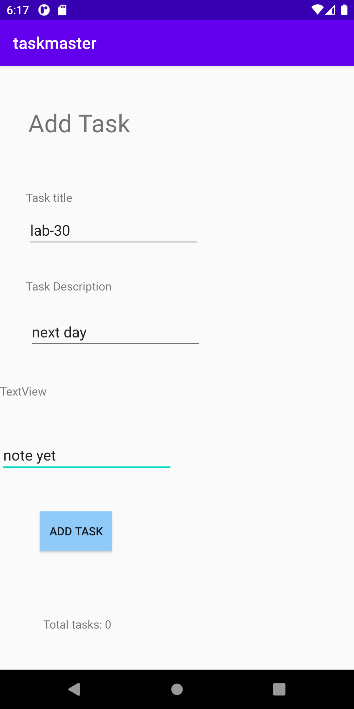
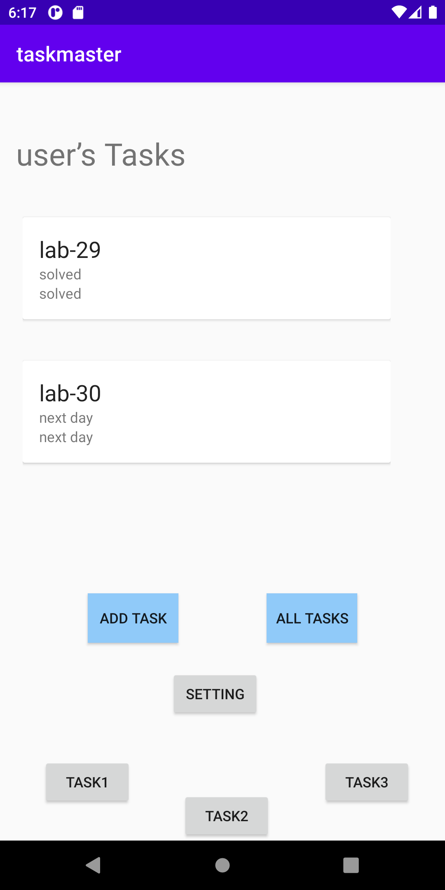
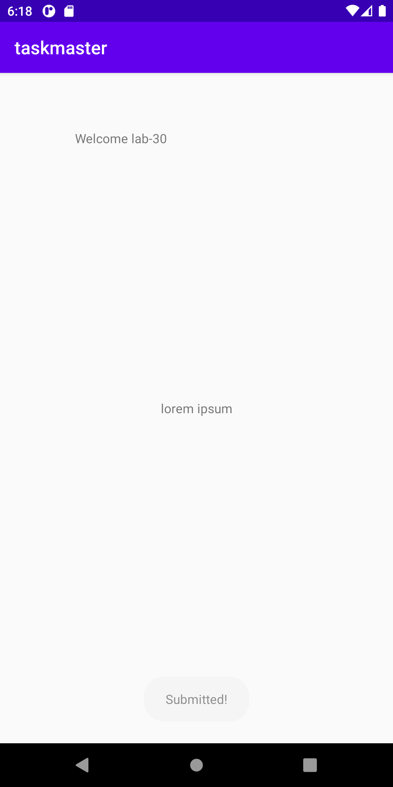

# taskmaster

Lab num|Date|Lab description
---|---|---
26|3/10|we added an Entity annotations for the Task class and we created dao to query our data and created database to cofiure our data base then created addTask with body and title and state and then when user inter the onfo it save it in the database and we get all the data in the main and then we render it using recyler view

Image:

w

