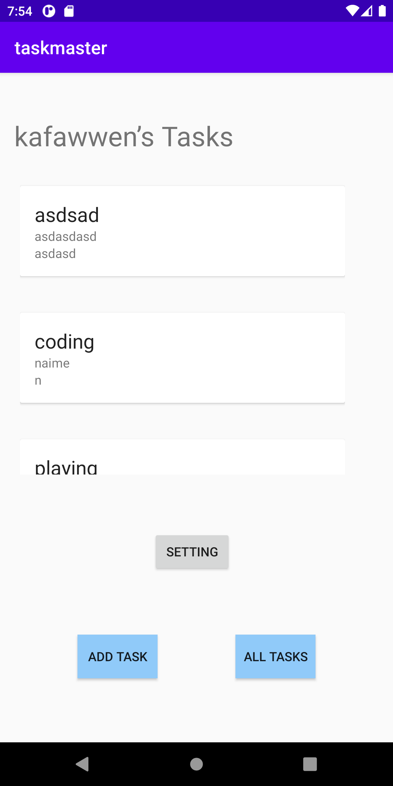
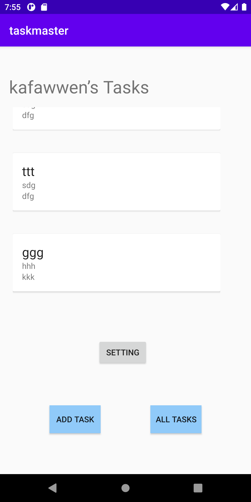
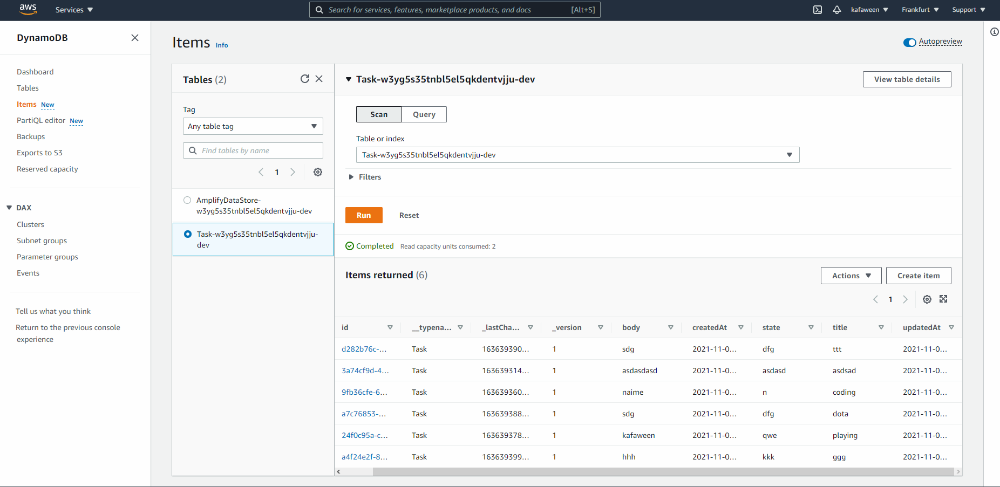

# taskmaster

Lab num|Date|Lab description
---|---|---
26|8/10| we added configuriation for aws amplify and then we did build to the model in the add task activity and we call the qury in the main and get all the data from aws and send it to the adapter to view it

Image:

