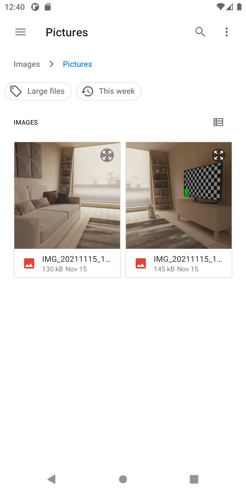
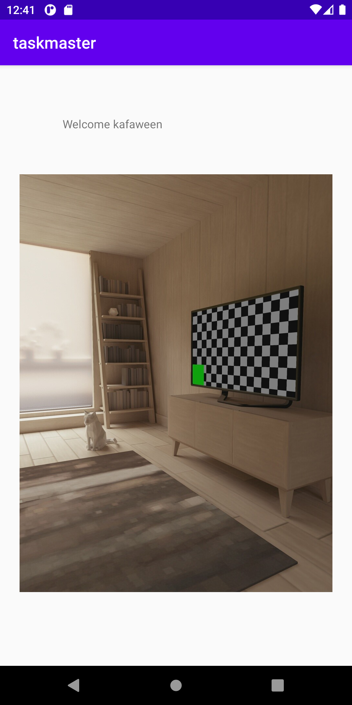

# taskmaster

Lab num|Date|Lab description
---|---|---
26|14/11| i refactored my code and my design and made splash page and added feature to add task to upload image and save it on s3 and vieing that image when clicking on the task in the task details

Image:

